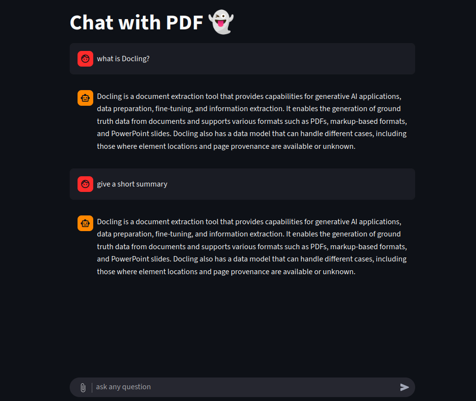
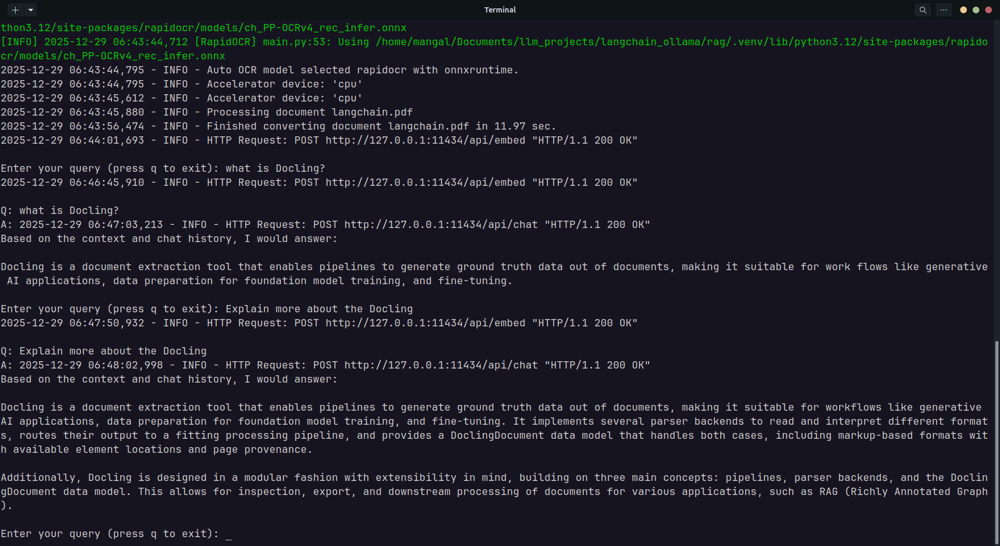

# 📚 RAG using Langchain,chromaDB,ollama,streamlit

A minimal end‑to‑end Retrieval‑Augmented Generation (RAG) example built with LangChain, Ollama, and Streamlit.
It shows how to:
- ingest PDFs/CSV/Word/Excel files on‑the‑fly,
- store them in a persistent Chroma vector store,
- retrieve relevant chunks with similarity search, and
- stream answers from a local Ollama LLM (e.g., llama3.2:3b).

Both a web UI (ui.py) and a console version (main.py) are provided, together with the core pipeline implementation (rag_pipeline.py).

## 🎯 What’s Inside
| File | Purpose|
|-----------------|--------------------------------------------------------------------------------------------------------------------------------------------------------------|
| ui.py | Streamlit front‑end – chat UI, file upload, message history, streaming responses.|
| rag_pipeline.py | RagPipeline class – builds the LLM, embeddings, Chroma DB, text splitter, prompt template, and helper methods (store_docs, get_retriever, create_rag_chain). |
| main.py | Simple terminal REPL – loads all documents from a folder, then loops for user queries, printing streamed.|
## 🚀 Features

- **Local‑only stack** – No external APIs; everything runs on your machine (Ollama, Chroma).

- **Dynamic document ingestion** – Drag‑and‑drop PDFs/CSV/Docx/Xlsx in the UI; the same loader works in the console version.

- **Chunked indexing** – Recursive character splitter (default 1 000 tokens, 100 overlap) creates manageable pieces for similarity search.

- **Similarity retrieval**  – Configurable top_k (default 2) to fetch the most relevant chunks.
- **Streaming LLM output**  – Answers appear token‑by‑token, giving a responsive feel.
- **Chat history preservation** – st.session_state (UI) or an in‑memory list (console) feeds prior turns back into the prompt.

## Screenshots


<!-- [](./Screenshots/ScreenRecord.mp4) -->


## 🛠️ Prerequisites

To run this application, you'll need to install the following Python packages:

* Python ≥ 3.8
* LangChain
* Ollama installed and running locally (ollama serve)
* Streamlit

## 📦 Installation
```bash
# 1️⃣ Clone the repo
git clone https://github.com/Mangaleshwaran2002/RAG-using-Langchain-chromaDB.git
cd RAG-using-Langchain-chromaDB

# 2️⃣ Create & activate a venv (Linux/macOS)
python -m venv .venv
source .venv/bin/activate

#    Windows
.\.venv\Scripts\activate

# 3️⃣ Install Python dependencies
pip install -r requirements.txt
# (or, if you prefer UV)
uv pip install -r requirements.txt
```

## Start Ollama

Open a separate terminal and run:
```bash
ollama serve     # keeps the Ollama daemon listening on localhost:11434
```
Make sure the model you intend to use is pulled, e.g.:
```bash
ollama pull llama3.2:3b
```
Ensure Ollama is running
```bash
ollama serve  # Run in a separate terminal
```

### ▶️ Running the Demo

**Streamlit UI (app.py)**

```bash
streamlit run ui.py
# or, with uv:
uv run streamlit run ui.py
```
- Upload one or more supported files (.pdf, .csv, .docx, .xlsx).
- Type a question in the chat box – the app will retrieve relevant chunks, feed them to the LLM, and stream the answer.
- The conversation persists while the session lives; click “Reset conversation” (if you add such a button) to start fresh.


**Console version (main.py)**

```bash
python main.py
# or, with uv:
uv run main.py
``` 
- The script walks through ./data (or any folder you set in data_folder) and indexes every file it finds.
- At the prompt, type a question; hit Enter to receive a streamed answer.
- Type q to quit.


## ⚙️ Customising the Pipeline

All knobs live in the RagPipeline constructor:
```bash
RagPipeline(
    llm_model='llama3.2:3b',          # any Ollama model name
    embedding_model='nomic-embed-text',
    model_temperature=0.0,
    collection_name='RAG_collection',
    persist_directory='./my_chroma_db',
    Search_top_K=4,                  # number of retrieved chunks
    chunk_size=1000,
    chunk_overlap=100,
)
``` 
- Change the LLM – swap llm_model for another Ollama model (e.g., gemma3:1b).
- Persist data – point persist_directory to a permanent location to keep the index across runs.
- Adjust retrieval depth – modify Search_top_K.
- Tune chunking – play with chunk_size and chunk_overlap for larger or smaller documents.

## 🧪 Testing & Debugging
- Verify document loading – after store_docs, you can inspect vector_store._collection.count() (or the equivalent method) to confirm the number of indexed chunks.
- Check retrieval – call retriever.invoke("<your query>") manually in a Python REPL to see which passages are returned.
- Inspect prompts – the ChatPromptTemplate is defined in rag_pipeline.py; you can edit the system instruction or add few‑shot examples.


## 🤝 Contributing

Contributions are welcome! Here’s a quick workflow:
1. Fork the repository.
2. Create a feature branch (git checkout -b my‑feature).
3. Write tests (if you add new logic) and ensure existing ones still pass.
4. Run black . and flake8 to keep formatting consistent.
5. Submit a Pull Request with a clear description of the change.
## License
This project is licensed under the MIT License - see the LICENSE file for details.